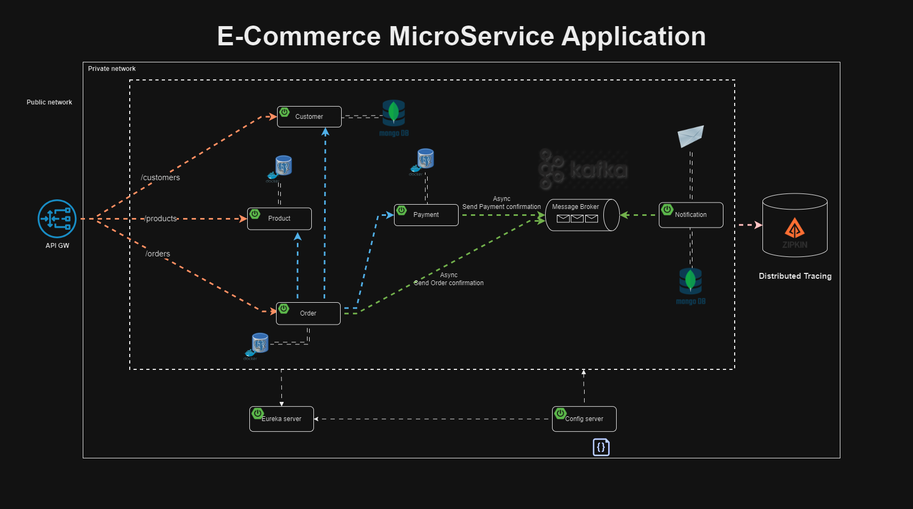

# E-Commerce MicroService Application

## Overview
The **E-Commerce MicroService Application** is a distributed system designed for scalable and robust online commerce. It adheres to **Domain-Driven Design (DDD)** principles, ensuring modularity and maintainability.

This application leverages cutting-edge technologies to handle complex workflows, ensuring high availability and fault tolerance.

## Architecture


The architecture employs microservices that communicate asynchronously using Kafka and synchronously using OpenFeign and RestTemplate. Each service is designed to handle a specific domain, adhering to the principles of **Domain-Driven Design**.

## Key Features
- **Distributed Microservice Architecture**: Ensures scalability and modularity.
- **Event-Driven Communication**: Kafka and Zookeeper provide reliable messaging.
- **Centralized Configuration**: Managed via Spring Cloud Config Server.
- **Service Discovery**: Enabled by Spring Cloud Discovery Server.
- **Authentication and Authorization**: Secured with Keycloak.
- **Tracing and Monitoring**: Powered by Zipkin for distributed tracing.

## Technologies Used
- **Spring Boot**
- **Spring Cloud**:
    - OpenFeign
    - RestTemplate
    - Discovery Server
    - Config Server
- **Apache Kafka**
- **Zookeeper**
- **Keycloak**
- **Zipkin**
- **Domain-Driven Design (DDD)**

## Microservices List
1. **User Service**: Manages user registration, authentication, and roles.
2. **Product Service**: Handles product creation, updates, and inventory management.
3. **Order Service**: Processes orders and manages transactions.
4. **Notification Service**: Sends emails or messages for order updates.
5. **Payment Service**: Manages payment processing and reconciliation.

## Setup Instructions
### Prerequisites
- Java 17 or higher
- Docker & Docker Compose
- Maven
- Keycloak configured with the appropriate realms and roles

### Steps to Run
1. Clone the repository:
   ```bash
   git clone https://github.com/Aligorithm-97/ms-e-commerce.git
